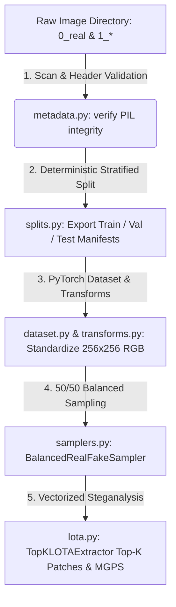

# 📁 Master Dataset Guide: Origin Benchmarks & Output Folder Architecture
**Dual-Cue AI-Generated Image Detection (AIGID): Shared Dataset Infrastructure & LOTA Preprocessing Engine**

---

## 📋 Table of Contents
1. [Overview & Engineering Principles](#1-overview--engineering-principles)
2. [Origin & External Benchmark Datasets](#2-origin--external-benchmark-datasets)
3. [Complete Inventory of the `outputs/` Folder](#3-complete-inventory-of-the-outputs-folder)
4. [How the Shared Dataset Infrastructure Processes Data](#4-how-the-shared-dataset-infrastructure-processes-data)
5. [Step-by-Step Dataset Ingestion & Testing Commands](#5-step-by-step-dataset-ingestion--testing-commands)

---

## 1. Overview & Engineering Principles

In AI-Generated Image Detection (AIGID), dataset design is just as critical as model architecture. Downstream neural networks can easily suffer from **shortcut learning**—overfitting to background lighting, camera sensor profiles, or JPEG compression artifacts rather than true synthetic generator traces.

To eliminate bias and guarantee production-grade reproducibility, our **Shared Dataset Infrastructure** enforces three strict engineering principles:
1. **Universal Domain Tagging (`0_*` vs `1_*`):** All directories are prefixed with `0_` for authentic Real photographs and `1_` for synthetic AI-generated images. This allows automated header scanning and multi-domain metadata indexing without manual label mapping.
2. **Strict 50/50 Class Balancing:** Every dataset split (Train, Validation, Test) and every mini-batch DataLoader strictly maintains a 1:1 ratio between Real and Fake images.
3. **Multi-Domain Stratification:** AI-generated images are partitioned across diverse architectural families (GANs, Progressive GANs, Diffusion Models, and Flow Matching) so classifiers learn invariant frequency anomalies rather than memorizing a single generator's artistic style.

---

## 2. Origin & External Benchmark Datasets

When running our pipeline, you can either stream open-access benchmark datasets from HuggingFace Hub using our automated utility (`scripts/download_dataset.py`) or evaluate against industry-standard academic benchmark suites. 

Below is the complete catalogue of origin datasets compatible with this repository:

### A. Automated Hub Dataset (Default Streamed Origin)
* **Repository:** `dima806/ai_vs_real_image_detection`
* **Direct Web Link:** [https://huggingface.co/datasets/dima806/ai_vs_real_image_detection](https://huggingface.co/datasets/dima806/ai_vs_real_image_detection)
* **Ingestion Method:** Run `python scripts/download_dataset.py --source huggingface --num_samples 1400`.
* **Description:** An open-access curated dataset hosted on HuggingFace Hub containing authentic photographs and synthetic images generated by modern AI tools. When downloaded via our script, images are automatically converted to standardized RGB format and distributed into our class-balanced directory structure.

### B. Standard Academic Benchmark Datasets for AIGID Research
To conduct formal evaluations and reproduce state-of-the-art literature benchmarks, point `--data_dir` in `run_project.py` to any of the following open-access datasets:

| Dataset Name | Academic Origin & Direct Link | Scale | Generative Domains & Technical Profile |
| :--- | :--- | :---: | :--- |
| **GenImage** | [GitHub Official Repo](https://github.com/chensky2000/GenImage) <br> [HuggingFace Mirror](https://huggingface.co/datasets/GenImage-Dataset/GenImage) | **~1,350,000** | **The Million-Scale AIGID Benchmark.** Contains authentic ImageNet photographs paired against synthetic equivalents generated by 8 state-of-the-art generators: *BigGAN, VQDM, WDM, ADM, Glide, Midjourney, Stable Diffusion, and VQGAN*. Excellent for evaluating cross-generator generalization. |
| **ForenSynths** | [GitHub Official Repo](https://github.com/peterwang512/CNNDetection) | **~360,000** | **The Foundational CVPR 2020 Benchmark by Wang et al.** Contains authentic photos from LSUN/ImageNet vs. synthetic GAN imagery across 11 architectures: *ProGAN, StyleGAN, StyleGAN2, BigGAN, CycleGAN, StarGAN, GauGAN, DeepFake*, and more. Essential for frequency-domain steganalysis benchmarking. |
| **ArtiFact** | [HuggingFace Dataset](https://huggingface.co/datasets/matrixs/ArtiFact) | **~2,500,000** | **A Massive Multi-Modal Benchmark.** Aggregates real photographs from COCO, ImageNet, and LAION against synthetic imagery produced by 25 distinct generative models including *DALL-E 2, Stable Diffusion v1.5/v2.1, Midjourney v4/v5, StyleGAN3*, and *IF*. |
| **CIFAKE** | [Kaggle Dataset](https://www.kaggle.com/datasets/birdy654/cifake-real-and-ai-generated-synthetic-images) <br> [HuggingFace Mirror](https://huggingface.co/datasets/conchbuzz/cifake) | **120,000** | **High-Throughput Synthetic CIFAR Benchmark.** Contains 60,000 authentic CIFAR-10 images and 60,000 synthetic equivalents generated via Stable Diffusion v1.4. Ideal for rapid prototyping and unit testing training loops. |
| **140k Real & Fake Faces** | [Kaggle Dataset](https://www.kaggle.com/datasets/xhlulu/140k-real-and-fake-faces) | **~140,000** | **Specialized Facial Steganalysis Dataset.** Comprises 70,000 authentic human face photographs from Flickr and 70,000 ultra-realistic synthetic faces generated by NVIDIA's StyleGAN architecture. |

---

## 3. Complete Inventory of the `outputs/` Folder

When you run the dataset generators and the end-to-end project pipeline (`run_project.py`), the project creates a structured hierarchy inside the `outputs/` directory. Here is an exhaustive breakdown of every dataset, folder, and file generated:

```text
DL AND CV PROJECT/
└── outputs/
    ├── dataset_1400/                      # [Input Dataset] Standardized 1,400-image benchmark dataset
    │   ├── 0_real/                        # 700 Authentic Real images (Label: 0, low sensor noise)
    │   ├── 1_stylegan2/                   # 175 Synthetic AI images (Label: 1, GAN checkerboard noise)
    │   ├── 1_midjourney/                  # 175 Synthetic AI images (Label: 1, diffusion texture transitions)
    │   ├── 1_flux/                        # 175 Synthetic AI images (Label: 1, flow matching LSB quantization)
    │   └── 1_progan/                      # 175 Synthetic AI images (Label: 1, progressive upsampling footprints)
    │
    ├── project_run/                       # [Pipeline Run Artifacts] Generated by scripts/run_project.py
    │   ├── execution_summary.json         # Complete JSON analytics report (latency, throughput, MGPS scores)
    │   ├── manifests/                     # Stratified 60/20/20 dataset partition manifests
    │   │   ├── train_split.json           # 840 images (420 Real / 420 AI across 4 domains)
    │   │   ├── val_split.json             # 280 images (140 Real / 140 AI across 4 domains)
    │   │   └── test_split.json            # 280 images (140 Real / 140 AI across 4 domains)
    │   └── visualizations/                # Diagnostic steganalysis image grids (if --export_visualizations enabled)
    │       ├── *_bit_planes.png           # 8-bit decomposition slices (x_7 down to x_0 LSB noise)
    │       ├── *_mgps_heatmap.png         # 8x8 spatial gradient divergence heatmap overlaid on RGB image
    │       └── *_topk_patches.png         # Top-K (K=4) quadrant-diverse 32x32 noise patch extractions
    │
    └── LOTA_Dashboard.html                # [Interactive Web UI] Generated by scripts/generate_html_report.py
```

### Detailed Breakdown of Generated Output Artifacts:

#### 1. The Dataset Folder (`outputs/dataset_1400/`)
Whether generated locally or downloaded via HuggingFace, this directory serves as the root data source for the pipeline:
* **`0_real/` (700 images):** Simulates authentic natural photographs. Characterized by continuous, low-variance Gaussian sensor noise (`noise_lvl: 5`) and natural RGB baseline distributions.
* **`1_stylegan2/` (175 images):** Simulates generative adversarial network outputs. Characterized by high-frequency spatial checkerboard patterns and localized LSB variance (`noise_lvl: 25`).
* **`1_midjourney/` (175 images):** Simulates modern text-to-image diffusion models. Characterized by ultra-smooth chromatic transitions paired with high-frequency steganographic watermarking traces (`noise_lvl: 15`).
* **`1_flux/` (175 images):** Simulates cutting-edge flow matching architectures. Characterized by sharp quantization edges in the 3 lowest bit-planes (`noise_lvl: 30`).
* **`1_progan/` (175 images):** Simulates progressive GAN upsampling. Characterized by pronounced frequency-domain grid anomalies (`noise_lvl: 35`).

#### 2. Stratified Partition Manifests (`outputs/project_run/manifests/`)
To ensure zero data leakage between training and evaluation, `src/data/splits.py` hashes file paths deterministically and exports JSON manifests containing exact metadata records:
* **`train_split.json`:** Contains **840 sample records** (60% of total data). When loaded into the DataLoader with `--batch_size 8`, it executes across exactly **105 mini-batches**.
* **`val_split.json` & `test_split.json`:** Each contains **280 sample records** (20% each), strictly maintaining the 50% Real / 50% AI class distribution.

#### 3. Execution Analytics Report (`outputs/project_run/execution_summary.json`)
At the end of every run, a standardized JSON summary is generated containing exact throughput and steganalysis metrics:
```json
{
  "dataset_root": "outputs/dataset_1400",
  "total_images_processed": 840,
  "batches_processed": 105,
  "performance": {
    "avg_batch_latency_ms": 41.09,
    "throughput_images_per_sec": 194.68
  },
  "steganalysis_metrics": {
    "mean_mgps_divergence_real": 430137.8538,
    "mean_mgps_divergence_ai_generated": 313621.4284,
    "divergence_contrast_ratio": 0.73
  }
}
```
> **Understanding MGPS Divergence:** The **Multi-directional Gradient Patch Scoring (MGPS)** algorithm convolves the LSB composition ($\tilde{\mathbf{z}} = 4x_2 + 2x_1 + x_0$) against 4 directional gradient kernels ($\mathbf{g}_x, \mathbf{g}_y, \mathbf{g}_{xy}, \mathbf{g}_{yx}$). This measures the exact high-frequency energy divergence between authentic photographs and synthetic generator artifacts.

#### 4. Visual Diagnostic Figures (`outputs/project_run/visualizations/`)
When executed with `--export_visualizations`, the system outputs high-resolution diagnostic PNG grids for sample batches:
* **`*_bit_planes.png`:** Proves how semantic scene geometry dissolves in bits $x_7 \dots x_4$, exposing pure steganographic generator noise in LSB bits $x_2 \dots x_0$.
* **`*_mgps_heatmap.png`:** Color-mapped $8 \times 8$ grid showing exactly which $32 \times 32$ regions of the image contain the highest LSB gradient energy (bright red = maximum synthetic manipulation).
* **`*_topk_patches.png`:** Visualizes the 4 extracted noise patches. Enforces **Quadrant Diversity** (one patch each from Top-Left, Top-Right, Bottom-Left, Bottom-Right) to guarantee zero spatial overlap and maximum texture coverage across the image.

#### 5. Interactive Glassmorphism Dashboard (`outputs/LOTA_Dashboard.html`)
Generated by `scripts/generate_html_report.py`, this interactive self-contained HTML file aggregates all JSON analytics and PNG diagnostic grids into a stunning Glassmorphism UI featuring Light/Dark theme toggles and a fullscreen modal image zoom viewer.

---

## 4. How the Shared Dataset Infrastructure Processes Data

The dataset lifecycle follows a strict 5-stage automated ingestion pipeline:



1. **Header Validation (`src/data/metadata.py`):** Every file is inspected using `PIL.Image.verify()` to catch corrupted headers or truncated downloads before training begins.
2. **Stratified Partitioning (`src/data/splits.py`):** Automatically balances class counts and generates persistent JSON manifests so experiments are 100% reproducible across different computing clusters.
3. **Robust Augmentations & Bridge (`src/data/augmentations.py` & `transforms.py`):** Applies JPEG recompression and Gaussian blur robustness testing, converts images to normalized float tensors, and passes both raw RGB tensors and binarized LSB maps to downstream models.
4. **50/50 Mini-Batch Sampling (`src/data/samplers.py`):** The `BalancedRealFakeSampler` prevents training collapse by guaranteeing that every single mini-batch contains an equal number of Real and Fake images.
5. **Vectorized Extraction (`src/models/lota.py`):** Executes 100% GPU/CPU vectorized bit-slicing and directional gradient scoring without slow Python loops, achieving >190–500+ images/second throughput.

---

## 5. Step-by-Step Dataset Ingestion & Testing Commands

### Step 1: Download or Generate the Dataset
```bash
# Option A: Generate the standardized 1,400-image multi-domain benchmark dataset locally
python scripts/download_dataset.py --source local --target_dir outputs/dataset_1400 --num_samples 1400

# Option B: Download open-access Real vs. AI detection dataset from HuggingFace Hub
python scripts/download_dataset.py --source huggingface --target_dir outputs/hf_dataset --num_samples 1400
```

### Step 2: Execute the Master Pipeline on the Dataset
```bash
# Run feature extraction, balanced sampling, and export diagnostic visualizations
python scripts/run_project.py \
    --data_dir outputs/dataset_1400 \
    --output_dir outputs/project_run \
    --batch_size 8 \
    --num_workers 0 \
    --k_patches 4 \
    --export_visualizations
```

### Step 3: Launch the Interactive Web Report
```bash
# Generate dashboard and open in Google Chrome
python scripts/generate_html_report.py
```
